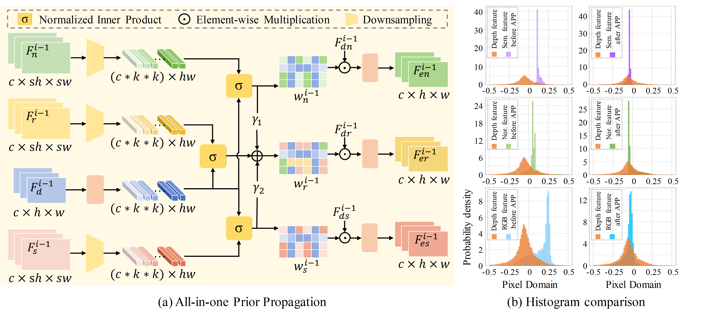
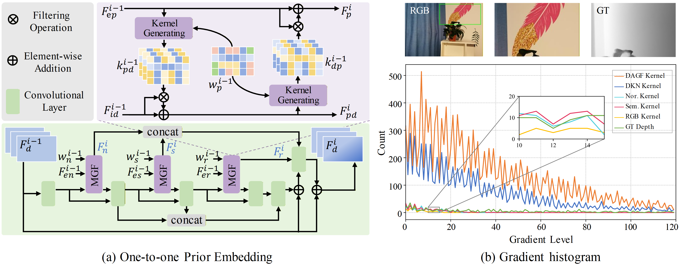
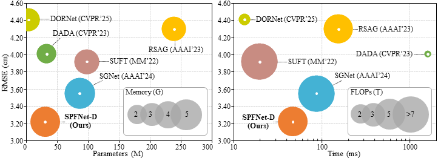
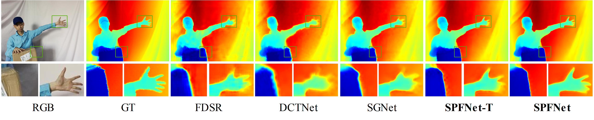

<p align="center">
<h2 align="center"> Scene Prior Filtering for Depth Map Super-Resolution </h2>

<p align="center"><a href="https://scholar.google.com/citations?user=VogTuQkAAAAJ&hl=zh-CN">Zhengxue Wang</a>, 
<a href="https://yanzq95.github.io/">Zhiqiang Yan</a>, 
<a href="https://faculty.ucmerced.edu/mhyang/">Ming-Hsuan Yang</a>, 
<a href="https://jspan.github.io/">Jinshan Pan</a>,
<a href="https://scholar.google.com/citations?user=6CIDtZQAAAAJ&hl=zh-CN">Jian Yang,
<a href="https://tyshiwo.github.io/">Ying Tai</a>,
<a href="https://guangweigao.github.io/">Guangwei Gao</a>
</p>

<p align="center">
[<a href="http://arxiv.org/abs/2402.13876"><strong>Paper</strong></a>]
[<a href="https://yanzq95.github.io/projectpage/SPFNet/index.html"><strong>Project Page</strong></a>]
</p>



Scheme of (a) All-in-one Prior Propagation (APP), and (b) histogram comparison of scene prior features before and after APP.




Scheme of (a) One-to-one Prior Embedding (OPE), and (b) gradient histogram of filter kernels in the texture area (green box). 


## Dependencies

```bash
Python==3.11.5
PyTorch==2.1.0
numpy==1.23.5 
torchvision==0.16.0
scipy==1.11.3
Pillow==10.0.1
tqdm==4.65.0
scikit-image==0.21.0
```

## Datasets
All Datasets can be found <a href="https://drive.google.com/file/d/10EtNWQyaC4TPRV7MY4d7E7OwTesixBEK/view?usp=sharing">here</a>.

## Models
All pretrained models can be found <a href="https://drive.google.com/drive/folders/1njJPTCmfe4YhLN-95awFrN2RhW5ThRdh?usp=sharing">here</a>.

## Training

### SPFNet
```
Train on synthetic NYU-v2
# x4 DSR
> python train.py --scale 4 --num_feats 42
# x8 DSR
> python train.py --scale 8 --num_feats 42
# x16 DSR
> python train.py --scale 16 --num_feats 42
Train on real-world RGB-D-D
> python train.py --scale 4 --num_feats 20 

```

### SPFNet-T
```
Train on synthetic NYU-v2
# x4 DSR
> python train.py --scale 4 --num_feats 6 --tiny_model
# x8 DSR
> python train.py --scale 8 --num_feats 6 --tiny_model
# x16 DSR
> python train.py --scale 16 --num_feats 6 --tiny_model
Train on real-world RGB-D-D
> python train.py --scale 4 --num_feats 6 --tiny_model
```

## Testing

### SPFNet
```
## Test on synthetic datasets
### x4 DSR
> python test.py --scale 4 --num_feats 42
### x8 DSR
> python test.py --scale 8 --num_feats 42
### x16 DSR
> python test.py --scale 16 --num_feats 42
## Test on real-world RGB-D-D
> python test.py --scale 4 --num_feats 20 --downsample real
```

### SPFNet-T
```
## Test on synthetic datasets
### x4 DSR
> python test.py --scale 4 --num_feats 6 --tiny_model
### x8 DSR
> python test.py --scale 8 --num_feats 6 --tiny_model
### x16 DSR
> python test.py --scale 16 --num_feats 6 --tiny_model
## Test on real-world RGB-D-D
> python test.py --scale 4 --num_feats 6 --downsample real --tiny_model
```

## Experiments

### Quantitative comparison

<p align="center">

</p>

### Visual comparison

<b>Train & test on real-world RGB-D-D: <b/>
<p align="center">

</p>

<b>Train & test on synthetic NYU-v2 (x16): <b/>
<p align="center">

</p>

## Acknowledgements

We thank [Xinni Jiang](https://jiangxinni.github.io/) for her invaluable assistance.

We thank these repos sharing their codes: [DKN](https://github.com/cvlab-yonsei/dkn) and [SUFT](https://github.com/ShiWuxuan/SUFT).


## Citation

```
@article{wang2024scene,
  title={Scene Prior Filtering for Depth Map Super-Resolution},
  author={Wang, Zhengxue and Yan, Zhiqiang and Yang, Ming-Hsuan and Pan, Jinshan and Yang, Jian and Tai, Ying and Gao, Guangwei},
  journal={arXiv preprint arXiv:2402.13876},
  year={2024}
}
```

